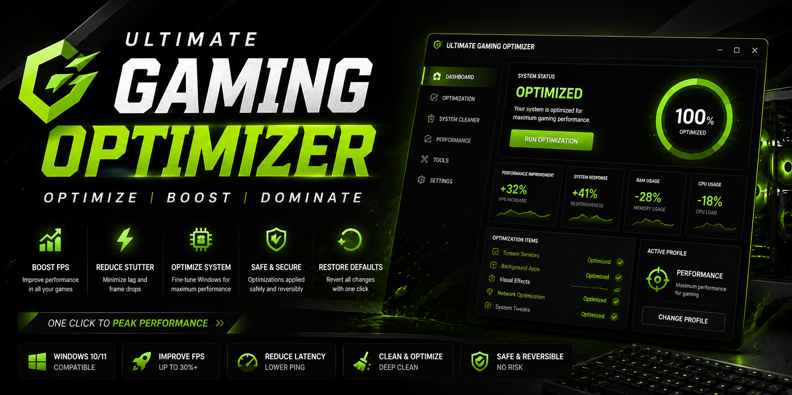
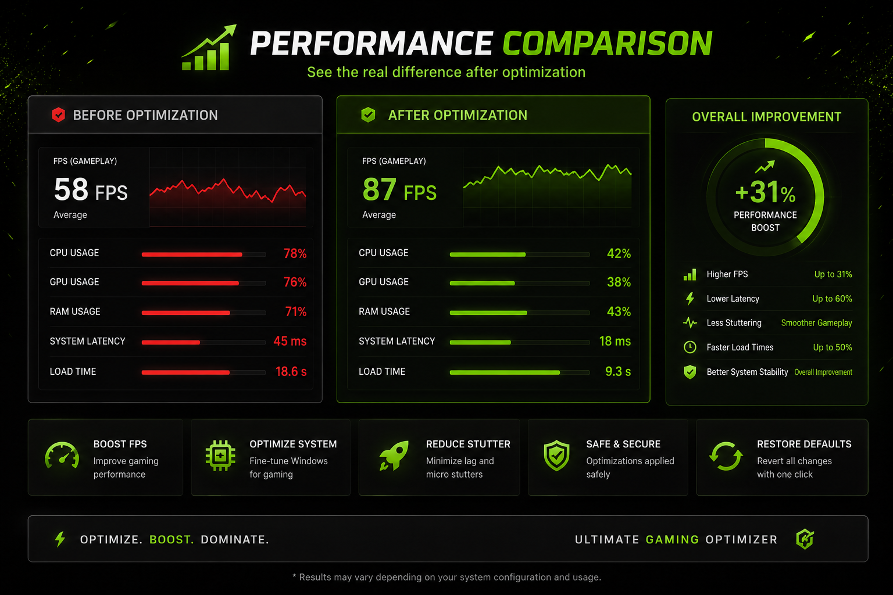

# Ultimate-Gaming-Optimizer
Boost gaming performance, reduce stuttering, optimize Windows, and improve system responsiveness with Ultimate Gaming Optimizer for Windows 10 and Windows 11

# Ultimate-Gaming-Optimizer

Ultimate Gaming Optimizer for Windows 10 & 11. Improve gaming performance, reduce stuttering, optimize system responsiveness, and enhance your gaming experience with one click.

<div align="center">




# 🚀 Ultimate Gaming Optimizer

### Boost Performance • Reduce Stuttering • Optimize Windows for Gaming

[](../../releases/latest)

</div>

---

## 🎯 What Is Ultimate Gaming Optimizer?

Ultimate Gaming Optimizer is a lightweight utility designed to help gamers improve system responsiveness and streamline Windows for gaming sessions.

Whether you're playing competitive shooters, open-world adventures, racing games, or simulation titles, the goal is simple:

✅ Better Responsiveness
✅ Cleaner Gaming Environment
✅ Reduced Background Activity
✅ Easy-To-Use Interface
✅ Windows 10 & 11 Support

---

## 📊 Performance Overview

| System Type         | Before   | After     |
| ------------------- | -------- | --------- |
| Entry-Level PC      | Baseline | Optimized |
| Mid-Range Gaming PC | Baseline | Optimized |
| High-End Gaming PC  | Baseline | Optimized |

*Results vary depending on hardware and software configuration.*

---

## ✨ Features

* 🎮 Gaming Performance Profiles
* 🚀 Startup Optimization
* 🧹 Temporary File Cleanup
* 💾 Cache Cleanup
* 🖥️ System Analysis Dashboard
* 📈 Performance Recommendations
* ⚡ Fast Optimization Engine
* 🔄 Restore Defaults
* 🪶 Lightweight Application

---

## 🖼️ Dashboard


---

## 📊 Performance Comparison



---

## 📥 Installation

1. Download the latest release.
2. Extract the ZIP archive.
3. Run:

```txt
UltimateGamingOptimizer_Setup.exe
```

4. Follow the installation wizard.
5. Launch the application.

---

## 🛠️ How To Use

```txt
1. Launch Ultimate Gaming Optimizer
2. Run System Analysis
3. Select a Performance Profile
4. Apply Optimizations
5. Start Your Game
```

### Profiles

| Profile        | Description                   |
| -------------- | ----------------------------- |
| 🟢 Safe        | Basic optimizations           |
| 🟡 Balanced    | Recommended profile           |
| 🔴 Performance | Enhanced performance profile  |
| ⚫ Extreme      | Advanced optimization profile |

---

## 🖥️ System Requirements

| Component | Minimum           | Recommended         |
| --------- | ----------------- | ------------------- |
| OS        | Windows 10 64-bit | Windows 11 64-bit   |
| CPU       | Dual-Core         | Intel i5 / Ryzen 5+ |
| RAM       | 8 GB              | 16 GB               |
| Storage   | HDD               | SSD / NVMe SSD      |

---

## ❓ Frequently Asked Questions

<details>
<summary><b>Is this safe to use?</b></summary>

Yes. The application focuses on performance-related optimization and management.

</details>

<details>
<summary><b>Can I restore original settings?</b></summary>

Yes. A restore option is available.

</details>

<details>
<summary><b>Does it support laptops?</b></summary>

Yes.

</details>

<details>
<summary><b>Does it support Windows 11?</b></summary>

Yes.

</details>

---

## 🗺️ Roadmap

* [x] Initial Release
* [x] Performance Profiles
* [x] Dashboard
* [ ] Hardware Detection
* [ ] Advanced Recommendations
* [ ] Update Notification System
* [ ] Enhanced Analytics

---

## 🤝 Contributing

Contributions, ideas, and feedback are welcome.

1. Fork the repository
2. Create a feature branch
3. Commit your changes
4. Submit a Pull Request

---

## ⭐ Support The Project

If Ultimate Gaming Optimizer helped improve your gaming experience, consider leaving a star.

---

## 📄 License

MIT License

See the LICENSE file for details.

---

<div align="center">

ultimate gaming optimizer • gaming performance • fps optimization • windows optimizer • gaming utility • stutter reduction • pc gaming • windows 11 gaming • windows gaming tool • game booster

SEO
ultimate gaming optimizer
gaming optimizer windows
fps boost tool
game booster pc
windows gaming optimizer
fps optimization utility
stutter fix windows
gaming performance enhancer
pc gaming optimization
windows performance tool

</div>
